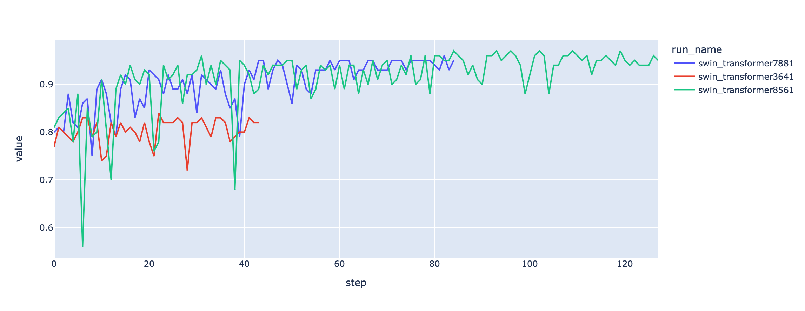
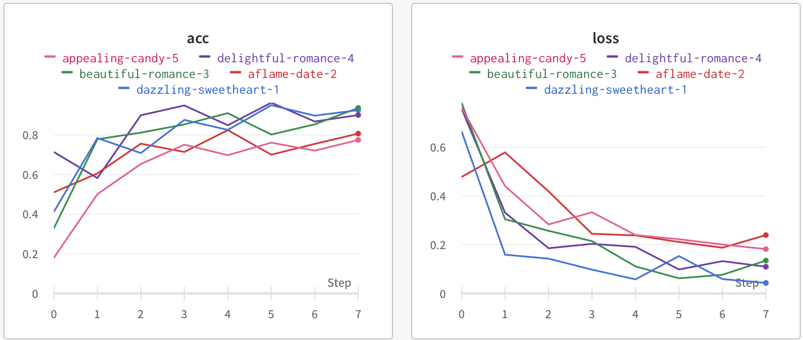

# PanelDL 🚀


## 🏃‍♀️ Quickstart

Use [PanelDL](http://paneldl.zidea.site) for machine learning experiment tarcking , dataset versioning and project Collaboration


## 🤩 A shared dashboard for your experiments

With just a few lines of code , you'll get rich , interactive , shareable dashboards



## 🪄 Install `PanelDL` library and login

1. install PanelDL with pip

```shell
pip install PanelDL

#python3
import PanelDL
```


2. [Register](http://paneldl.zidea.site/register/) 


## 👟 Run an experiment

1️⃣. **Start a new run** and pass in hyperparameters to track

2️⃣. **Log metrics** from training or evaluation

3️⃣. **Visualize results** in the dashboard


```python
import PanelDL
import random
PD = PanelDL()

#login with your email and password
PD.login(email,password)

#Launch 5 simulated experiments
total_runs = 5
for run in range(total_runs):
  #Track hyperparameters and run metadata
  config={
      "learning_rate": 0.02,
      "architecture": "CNN",
      "dataset": "CIFAR-100",
      "epochs": 10,
      }
  
  #1️⃣ Start a new run to track this scipt
  PD.init(project="basic-intro",config=config,run_name = "test"+run)
  # This simple block simulates a training loop logging metrics
  epochs = 10
  offset = random.random() / 5
  for epoch in range(2, epochs):
      acc = 1 - 2 ** -epoch - random.random() / epoch - offset
      loss = 2 ** -epoch + random.random() / epoch + offset
      # 2️⃣ Log metrics from your script to PanelDL
      PD.log({"acc": acc, "loss": loss})

```


3️⃣. Visualize results in [PanelDL](http://paneldl.zidea.site)





## 🔑PanelDL API 

Init the PanelDL

```python
import PanelDL
PD = PanelDL()
```


Login with your email and password

```python
PD.login(email,password)
```


Init your project with config and set your run_name

```
PD.init(project,config,run_name)
```


Log your data while training

```
PD.log(loc_dic)
```


# 🥳🥳🥳Have Fun With PanelDL!
